# Tutorial for placement of new sequences into our *Nostoc* phylogenetic framework

The phylogenomic species tree (wASTRAL) and the *rbcLX* section trees that we inferred as part of the paper are available on the [T-BAS](https://guide-tbas.cifr.ncsu.edu/tbas) platform. T-BAS has a user-friendly interface to place unknown taxa into existing phylogenetic trees using phylogenetic placement algorithms or de-novo phylogenetic inference with or without backbone constraints. All you need is a file(s) with sequences from the markers included in T-BAS and it will add the unknown taxa to the alignments, perform the phylogenetic analyses, and display and interactive tree plot with the reference taxa and the queries. You can also download the resulting or reference alignments to perform your own analyses outside of T-BAS.

I recommend that you [register to T-BAS](https://tbas.cifr.ncsu.edu/tbas2_3/pages/tbas-tutorial_1.php) to get access to the features.

T-BAS has its own tutorials for [phylogenetic placement and de-novo inference](https://tbas.cifr.ncsu.edu/tbas2_3/pages/tbas-tutorial_3.php) as well as for [viewing trees, alignments, and specimen metadata](https://tbas.cifr.ncsu.edu/tbas2_3/pages/tbas-tutorial_2.php). You can refer to those for general instructions on how to use the platform.

The purpose of this tutorial is to give guidelines for some specific use cases with unknown *Nostoc* sequences.

## Overview of available datasets

### Phylogenomic wASTRAL tree

When you go the the [T-BAS trees page](https://guide-tbas.cifr.ncsu.edu/tbas), you will see a guide tree with a summary of the datasets available in the dataset organized by taxonomic ranks:

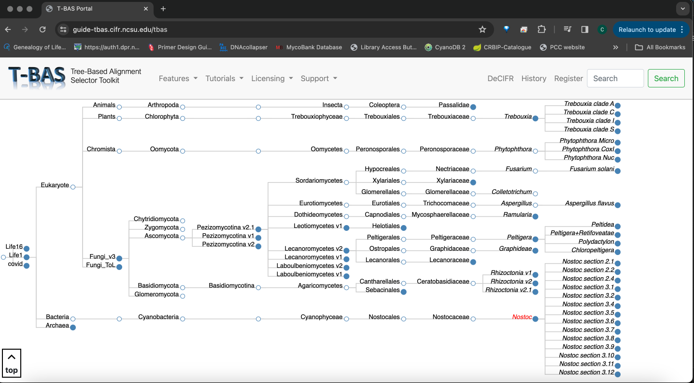

Whenever there is a filled bullet next to a rank, it means that a tree is available for that taxon. If you click on *Nostoc*, a cladogram version of the wASTRAL tree will appear below the guide tree:

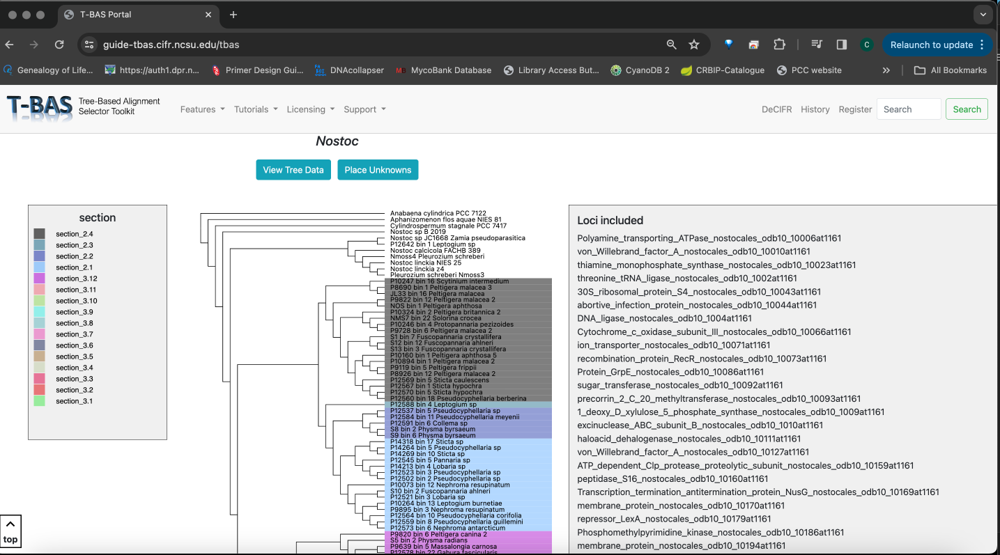

This is the phylogenomic tree and includes 1516 loci from the nostocales_odb10 used by busco. In T-BAS, the available alignments are listed under "Loci included", and they are labeled in the format `NAME_OF_PROTEIN_nostocales_od10_LOCUSCODE`. When doing placements, your fasta files must include the `LOCUSCODE` as part of the file name so T-BAS will recognize them automatically. If you use BUSCO to extract the loci as we did (see [4.1.1 Extraction of phylogenetic markers](https://github.com/cjpardodelahoz/nostoc/tree/main) in the main page), the output files will be labeled with those codes. [Here's a list](https://github.com/cjpardodelahoz/nostoc/tree/main/tbas_tutorial/nostocales_odb10_busco_ids.txt) of the codes for the 1516 loci we used from the nostocales_odb10.

In addition, this tree also includes full length 16S, *rbcLX* and *trnL*, for a total of 1519 loci.

The tip labels of this tree are by default colored by section, but you can change that to display the phylogroups instead. Note that not all genomes were assigned to a phylogroup.

### *rbcLX* section trees

The *rbcLX* section trees are also available, and they include sequences from previous studies as well as the sequences from the cyanolichen specimens from the ABMI sampling. For example, we can look at the tree for *Nostoc* section 3.5, which includes most of the symbionts of *Peltigera* section *Polydactylon*:

Scroll down to see the tree:

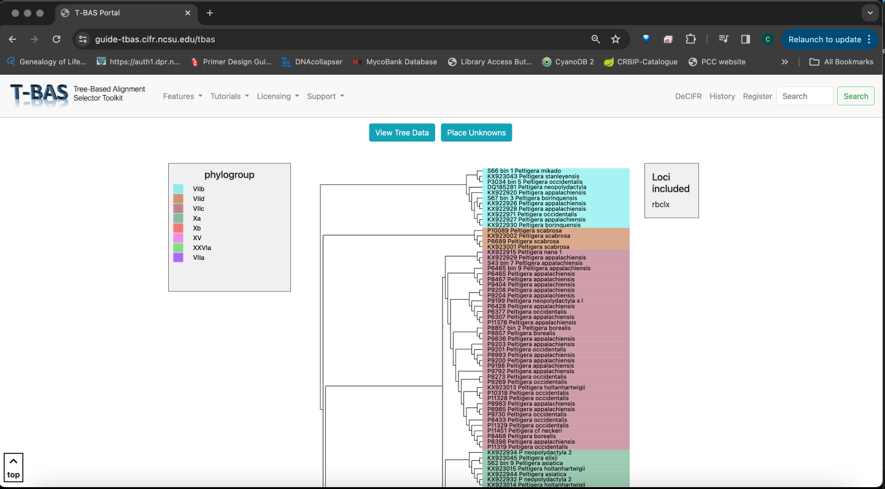

The tips labels are colored by phylogroup and this tree only includes *rbcLX* sequences.

## Placing queries with single-locus data

I expect that most of the single-locus queries will use 16S, *rbcLX* or *trnL*. So we will focus on examples with those markers.

### *rbcLX* unknowns 

If you have *rbcLX* data, you have the option to place your unknowns on the phylogenomic or section trees. A typical workflow with *rbcLX* would be to first place the queries on the phylogenomic tree with EPA to determine the section. If they fall within one of the known sections, then you can proceed to a de-novo phylogenetic analysis within the appropriate *rbcLX* section tree.

As an example, we are going to work with three unknown *rbcLX* sequences that correspond to three of the most common ASVs found in soil and in symbiosis with hornworts in a study by [Nelson et al. from 2021](https://bsapubs.onlinelibrary.wiley.com/doi/full/10.1002/ajb2.1729). These sequences are not part of our T-BAS dataset, so they are a relistic example.

#### EPA placement on phylogeneomic tree

* Step 1. Download the [fasta file with the *rbcLX* sequences](./nelson_etal_2021_rbclx.fasta) from this repository.

* Step 2. Go to the [T-BAS trees](https://guide-tbas.cifr.ncsu.edu/tbas) page, select the *Nostoc* tree and click "Place Unknowns":

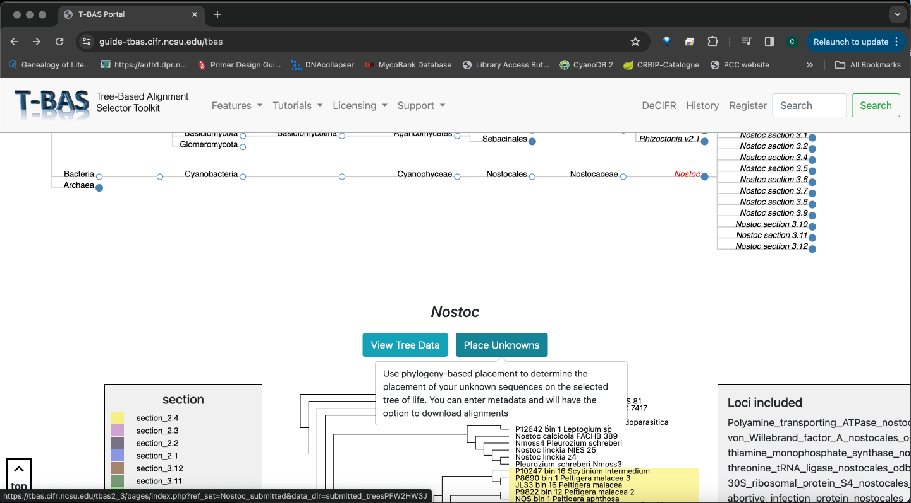

* Step 3. Drag and drop the fasta file to the unknown query sequence box. **REMEMBER: the file name must end with `rbclx.fasta` so T-BAS will recognize the locus:**

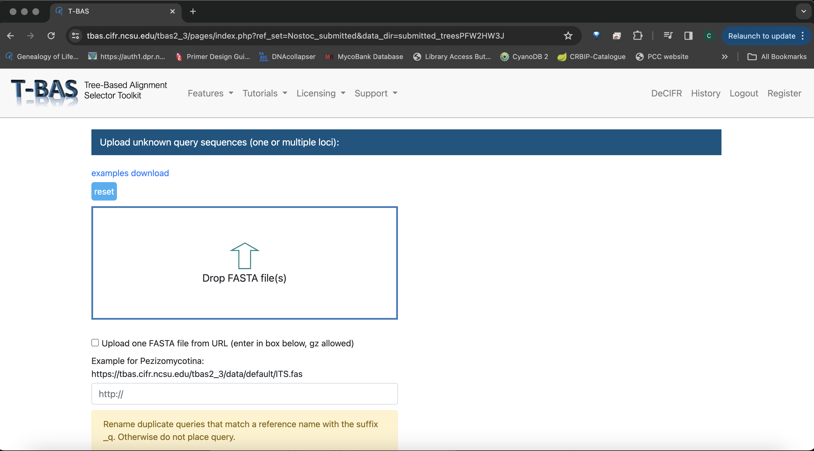
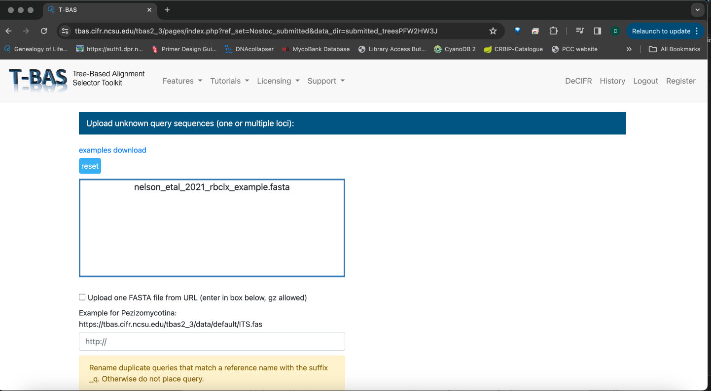

* Step 4. Scroll down to the phylogenetic analysis option and make sure that it is set to EPA-ng:

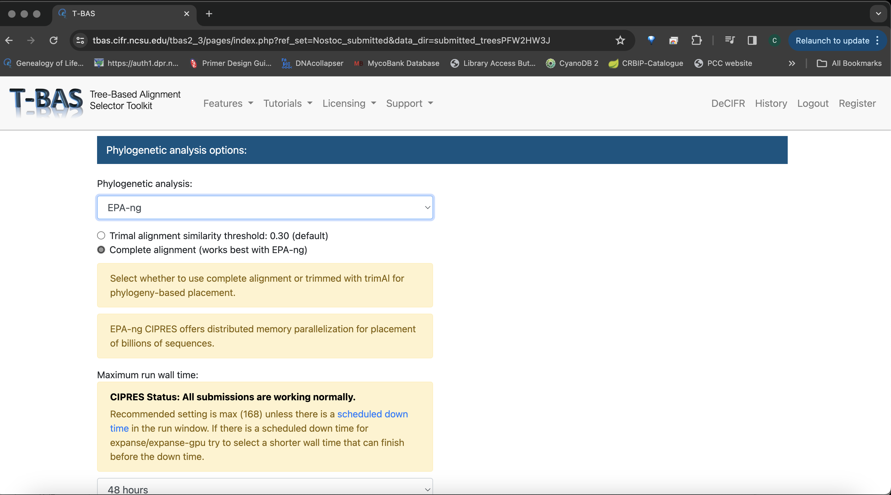

* Step 5. Keep the rest of the settings to their default and hit Submit at the bottom of the page. 
A blue progress bar that says "processing data" will appear the bottom. After a few seconds, a new tab shuold open in your browser.

* Step 6. Scroll down in the new window. This is where you indicate which loci your files correspond to. If you label the files so they end with the locus name, T-BAS will recognize them automatically, otherwise, you need to click on the dropdown and select the appropriate one:

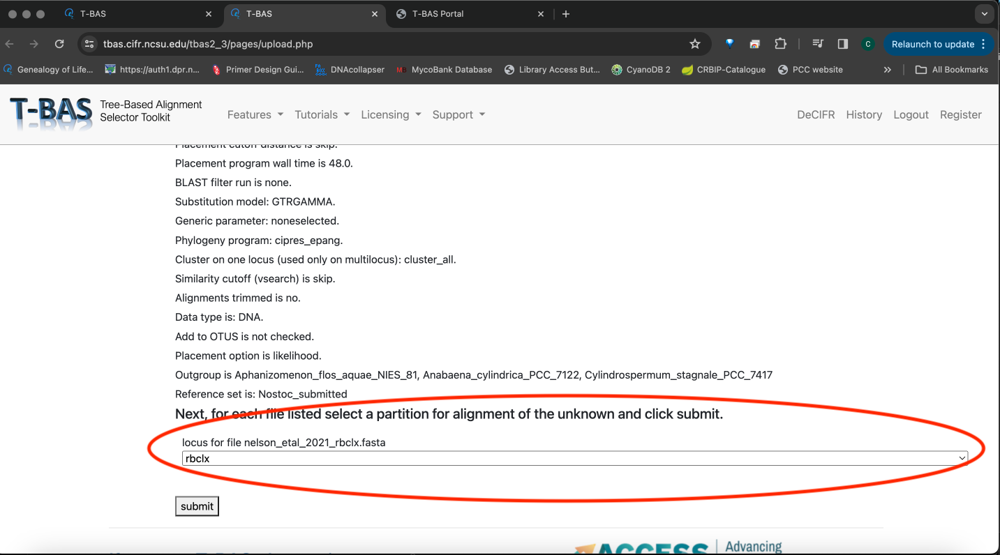

* Step 7. Hit the submit button. A progress bar will appear at the bottom. You will receive an email once the results are ready.

* Step 8. View the results and tree. When T-BAS finishes, you will receive an email notification with links to several report items. The most important ones are under the section titled **Phylogeny-based placement results**, where you can get the alignment in FASTA format that includes the reference sequences and your unknowns as well as several tables with assignment reports. You can also view the resulting tree directly in T-BAS by clicking the link under **View tree**:

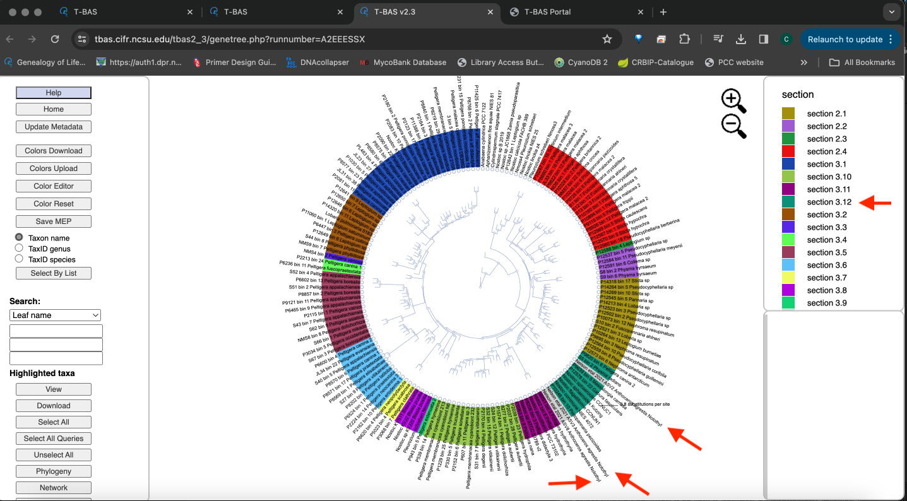

As you can see, **all three query sequences were placed within section 3.12**. Make sure to check out the tutorial for [phylogenetic placement and de-novo inference](https://tbas.cifr.ncsu.edu/tbas2_3/pages/tbas-tutorial_3.php) in T-BAS for more information on the things you can do within this interactive platform. We will now move on to place these sequences within the section tree

#### De-novo phylogenetic inference on *rbcLX* section 3.12 tree

* Step 9. Go back to the [T-BAS trees](https://guide-tbas.cifr.ncsu.edu/tbas) page, select the *Nostoc* section 3.12 tree and click "Place Unknowns".

* Step 10. Drag and drop the `nelson_etal_2021_rbclx.fasta` you downloaded in step 1 into the unknown query box. 

* Step 11. Under the **Phylogenetic analysis options** section, select the following settings:
    * Phylogenetic analysis: IQ_TREE
    * Complete alignment (works best with EPA-ng)
    * Uncheck Use partitions
    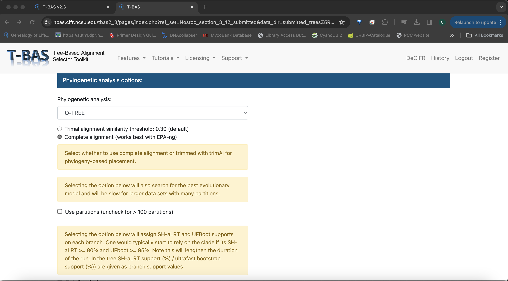
    * Check De novo single or multi-locus phylogenetic analysis
    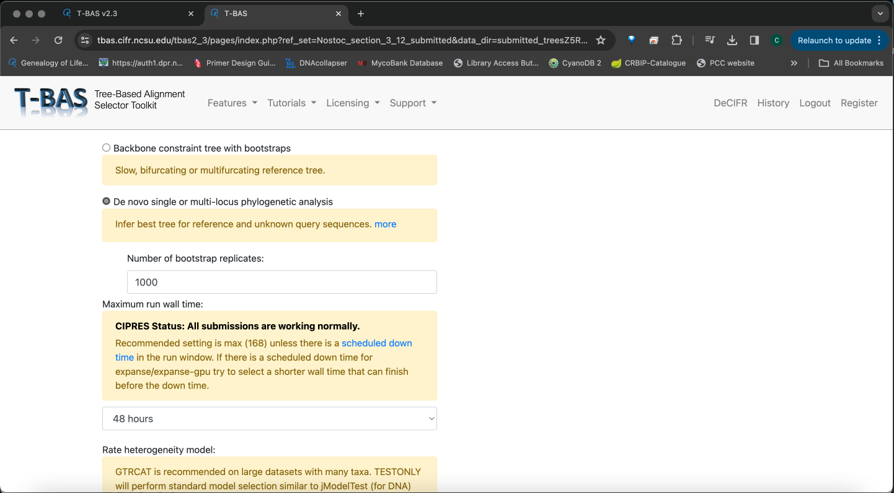
    * Leave the rest of the options with their default settings.

* Step 12. Click submit and wait for new tab to open.

* Step 13. In the new tab, verify that rbclx is the selected locus and hit submit.

* View the resulting tree

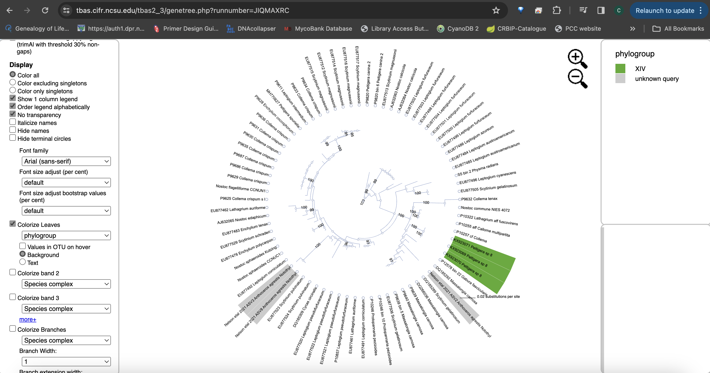

The numbers in the branches are UFBoot2 values and the unknown queries are highlighted in gray. **The conclusion we can draw from this is that the three ASVs represent at least two distinct lineages within *Nostoc* section 3.12, but they do not cluster with the phylogroup we recognized within this section, i.e., XIV**. This section includes both free-living *Nostoc* and cyanobionts of *Peltigera* and Collemataceae lichens.

### 16S unknowns 

The 16 rRNA locus is one of the most widely used markers for cyanobacteria and I am hopeful that including it in this phylogenomic framework will help link unify classifications for future taxonomic decisions. That said, even with the full length sequence, 16S is not variable enough to resolve some of the clades we found, but it should work well for identifying the sections and some phylogroups if they are represented.

For this example, we are going to use three sequences from:
* The recently described species *Nostoc neudorfense* in [Singh et al. 2020](10.1099/ijsem.0.004102). 
* A cyanobiont of *Peltigera aphthosa* from [Kaasalainen et al. 2015](https://journals.plos.org/plosone/article?id=10.1371/journal.pone.0131223).
* The type of *Desmonostoc muscorum* which was segregated from *Nostoc* in [Hrouzek et al. 2013](https://fottea.czechphycology.cz/artkey/fot-201302-0008_Description_of_the_cyanobacterial_genus_Desmonostoc_gen_nov_including_D_muscorum_comb_nov_as_a_distinct_p.php).

None of these sequences are included in our dataset, so this is a realistic example. We will do the placement on the phylogenomic tree and the process is very similar to what we did for *rbcLX*.

* Step 1. Download the [fasta file with the 16S sequences](./queries_16s.fasta) from this repository.

* Step 2. Go to the [T-BAS trees](https://guide-tbas.cifr.ncsu.edu/tbas) page, select the *Nostoc* tree and click "Place Unknowns":

* Step 3. Drag and drop the fasta file to the unknown query sequence box. **REMEMBER: the file name must end with `16s.fasta` so T-BAS will recognize the locus:**

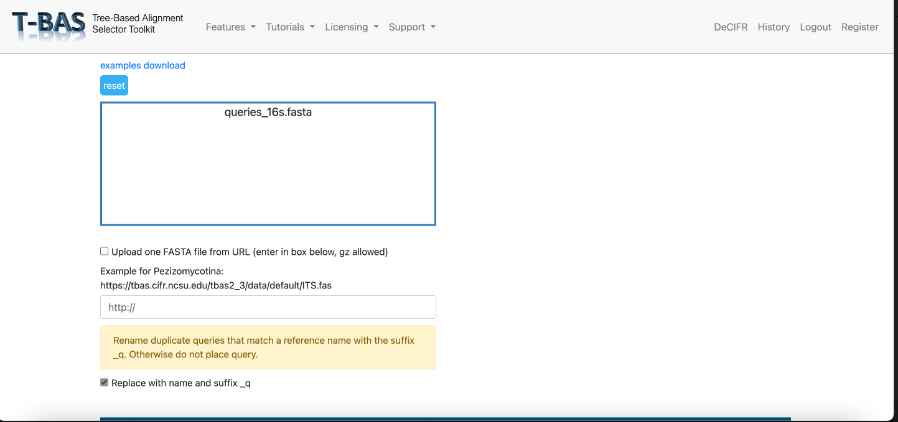

* Step 4. Scroll down to the phylogenetic analysis option and make sure that it is set to EPA-ng:

* Step 5. Keep the rest of the settings to their default and hit Submit at the bottom of the page. 
A blue progress bar that says "processing data" will appear the bottom. After a few seconds, a new tab shuold open in your browser.

* Step 6. Scroll down in the new window. This is where you indicate which loci your files correspond to. If you label the files so they end with the locus name, T-BAS will recognize them automatically, otherwise, you need to click on the dropdown and select the appropriate one:

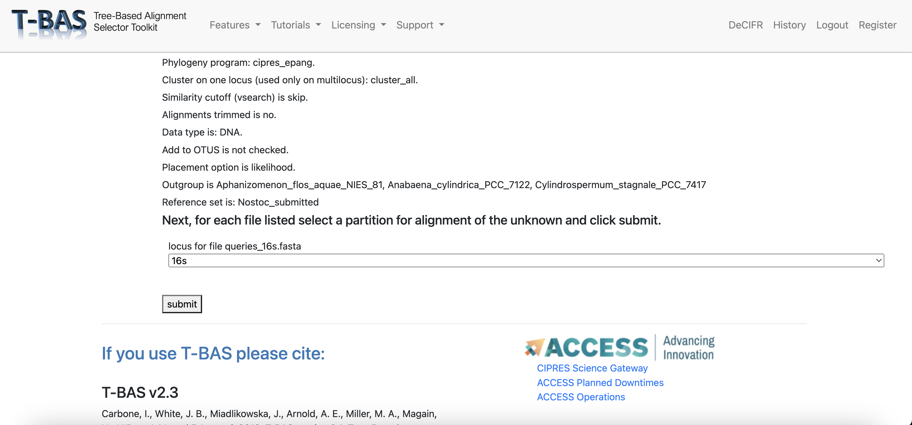

* Step 7. Hit the submit button. A progress bar will appear at the bottom. You will receive an email once the results are ready.

* Step 8. View the results and tree with the leaved colored by subclade.

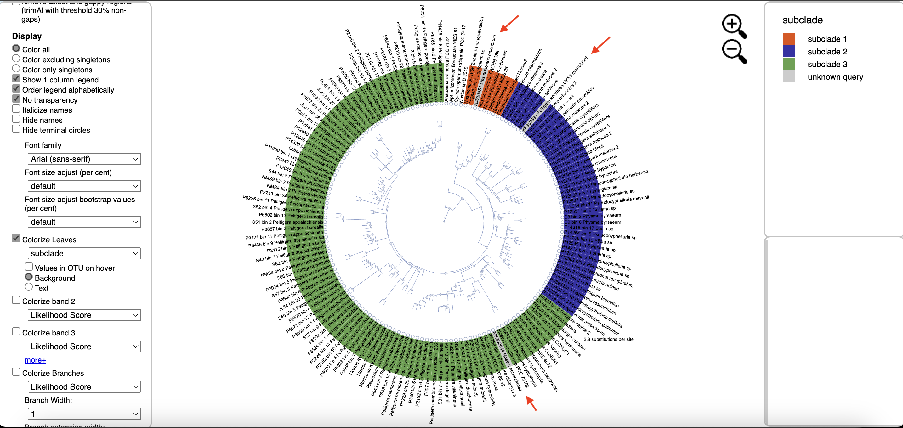

We can draw several interesting conclusions from this. First, the 16S from the type of *Desmonostoc muscorum* falls within subclade 1. Therefore, *Nostoc* subclade 1 (sensu [Otálora et al. 2010](https://www.sciencedirect.com/science/article/pii/S1055790310002320?via%3Dihub)) probably corresponds to the genus *Desmonostoc* described by [Hrouzek et al. 2013](https://fottea.czechphycology.cz/artkey/fot-201302-0008_Description_of_the_cyanobacterial_genus_Desmonostoc_gen_nov_including_D_muscorum_comb_nov_as_a_distinct_p.php)! *Desmonostoc* was segregated from *Nostoc* on the basis of 16S sequences and *Nostoc* subclade 1 was delimited on the basis of *rbcLX*. This is a great example of how this phylogenomic framework can help unify classifications in the future.

If we color the leaves by section, we can see that *Nostoc neudorfense* isolated is Czech Republic is part of section 3.11, which includes other european strains found in symbiosis with both fungi and plants (see DataS2J in our paper).

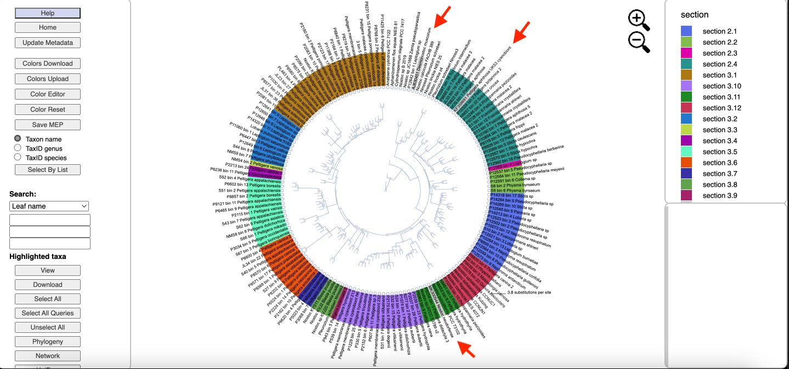

The query from a cyanobiont of *Peltigera aphthosa* falls in section 2.4, which is known to include cyanobionts of this lichen species. If we know color the leaves by phylogroup, we can see that this strain probably belongs to phylogroup IVa within section 2.4:

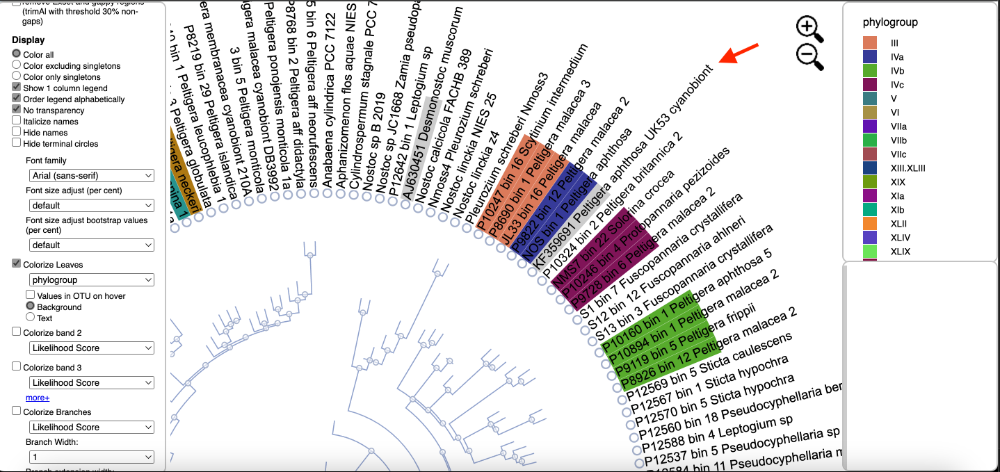

These three examples show how we can derive useful information from 16S data in this framework despite having different levels of phylogenetic resolution. As more genomes are sequenced, we will add them to the T-BAS tree and that will increase the power of this approach.

### *trnL* unknowns

The link with *trnL* is especially important for me because many cyanobionts of lichens have been genotyped with this marker and I want our phylogenomic framework to facilitate future connections between the work that has been done with *trnL* with what has been done with *rbcLX* in lichenized *Nostoc*. 

The challenge is that a lot of the useful variation of *trnL* is in a region of the locus that we could not align unambiguously across the entire genus and that region was excluded from the phylogenetic analyses. Therefore, the results of placements with a phylogenetic method might be unreliable. Instead, I recommend that yo use BLAST against a database with [the *trnL* sequences from the genomes included in our tree](./trnl_reference.fasta). This way, the classifications based on *trnL* can be linked with what we proposed based on genomes.

To illustrate this, let's use the example *trnl* sequences in [this fasta file](./rikkinen_etal_2002_trnl.fasta) from the seminal Science paper by [Rikkinen et al. 2002](https://www-science-org.proxy.lib.duke.edu/doi/10.1126/science.1072961) that prompted the popular guild hypothesis to explain some patterns of association in lichen communities. These are the results from BLAST of these example sequences to the reference ones from our tree:

| Query sequence | Best reference hit | % Similarity | Best hit clade |
| -------------- | -------- | ------------ | -------------- |
| AF509360_Nephroma_bellum_cyanobiont | P10073_bin_12_Nephroma_resupinatum | 100% | Section 2.1|
| AF509404_Pseudocyphellaria_anthraspis_cyanobiont | P12559_bin_8_Pseudocyphellaria_guillemini | 95.98% | Section 2.1 |
| AF509410_Peltigera_praetextata_cyanobiont | S32_bin_15_Peltigera_vitikainenii | 100% | Phylogroup XIII.XLIII |
| AF509425_muscicolous_Nostoc | P14320_bin_11_Leptogium_sp | 98.34% | Section 3.2 |

The cyanobionts from both *Nephroma bellum* and *Pseudocyphellaria anthraspis* are both part of Rikkinen's group A of *Nostoc* (*Nephroma*-type). The BLAST results indicate that this corresponds to our Section 2.1 (which we pointed out in our paper). The two other strains were part of Rikkinen's group B of *Nostoc* (*Peltigera/Collema*-type). The BLAST indicates that one of them is in phylogorup XIII.XLIII (section 3.10) and the other one might be from section 3.2.

Contrast that with what we get if we try to place these *trnL* queries with T-BAS:

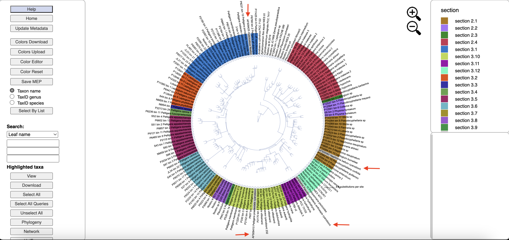

The placement of AF509360_Nephroma_bellum_cyanobiont and AF509410_Peltigera_praetextata_cyanobiont is the same as with BLAST, which makes sense because they are %100 identical to something in our dataset. But AF509404_Pseudocyphellaria_anthraspis_cyanobiont is placed in section 3.11, which is unlikely given that this clade includes mostly cyanobionts of *Peltigera* and the closest match for this sequence is from section 2.1. Something similar occurs with AF509425_muscicolous_Nostoc, which was placed here in section 3.1. This case is a bit trickier because the closest BLAST match is from section 3.2, but the sequence is not identical to the best hit, and the second best BLAST hit is in fact from sectino 3.1 with 98.01% similarity. Therefore, the placement of the AF509425_muscicolous_Nostoc *trnL* is somewhere in subclade 3, but we have no certainty of the section.

 These are good examples of how we can use this framework to unify these systems of classification that lichenologist have been using to understand the diversity of lichenized *Nostoc*. But you should keep in mind that there will be different levels of uncertainty in the placement depending on how similar your queries are to the sequences in our dataset. BLAST seems like a more reliable way using *trnL* data to our phylogenomic framework.

## Placing queries with genomic data

This is by far the most powerful method. In this case, you can use either EPA placement, de novo phylogenetic inference with a backbone constraint, or a de novo inference without constraint. All approaches should give you a robust placement with genomic data. However, If you don't use a backbone constraint, keep in mind that you will be doing a concatenated ML search which will give you high supoprt values even for internodes in the anomaly zone. See [our paper in Systematic Biology](https://academic.oup.com/sysbio/article/72/3/694/7056769) for an in-depth discussion on this topic.

For this example, we are going to use the genome of the strain [*Nostoc punctiforme* NIES 2108](https://www.ncbi.nlm.nih.gov/nuccore/LXQE00000000.1) which was assembled from the metagenome of a specimen of *Peltigera didactyla* from Japan. This genome is not part of our T-BAS dataset and we don't have any sequences of *Nostoc* from *Peltigera didactyla* collected in Japan, so this is a realistic example.

We ran BUSCO with the nostocales_odb10 on this genome and were able to recover 1513 of the 1517 loci listed in `nostocales_odb10_busco_ids.txt`. For speed, we will use EPA in the tutorial but you can play around with different phylogenetic analysis settings!

* Step 1. Download the sequence data under `nostoc_punctiforme_nies_2108/`, which contains one fasta file per locus. We modified the fasta headers from the BUSCO output so that all sequences were labeled `Nostoc_punctiforme_NIES_2108`.

* Step 2. Go to the [T-BAS trees](https://guide-tbas.cifr.ncsu.edu/tbas) page, select the *Nostoc* tree and click "Place Unknowns":

* Step 3. Drag and drop the fasta files to the unknown query sequence box. **REMEMBER: the file names must end with `BUSCOCODE.fasta` so T-BAS will recognize the locus:**

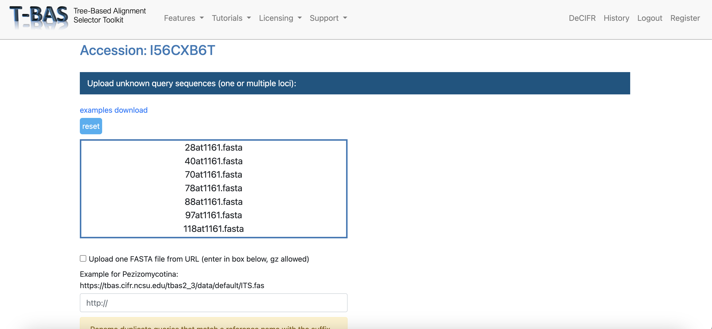

You shuold be able to scroll inside the box and see all the files.

* Step 4. Scroll down to the phylogenetic analysis option and make sure that it is set to EPA-ng:

* Step 5. Keep the rest of the settings to their default and hit Submit at the bottom of the page. 
A blue progress bar that says "processing data" will appear the bottom. After a few seconds, a new tab shuold open in your browser.

* Step 6. You have to scroll way down in the new window. T-BAS should recognize the loci automatically:

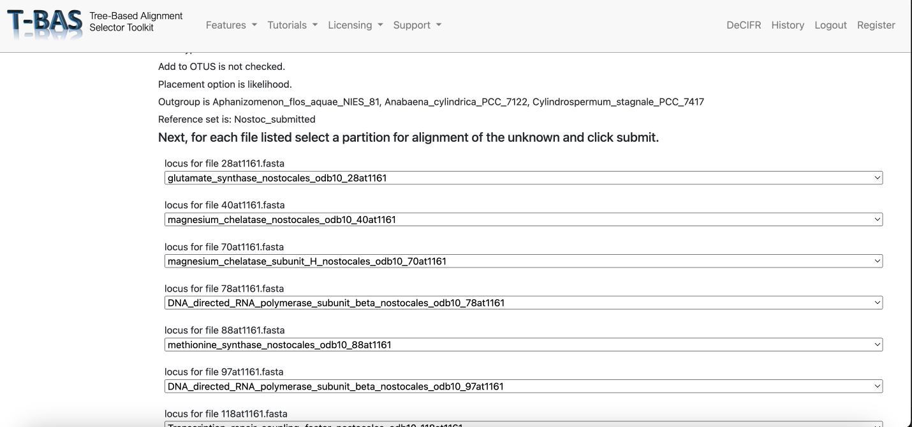

* Step 7. You have to scroll all the way down and hit the submit button. A progress bar will appear at the bottom. You will receive an email once the results are ready.